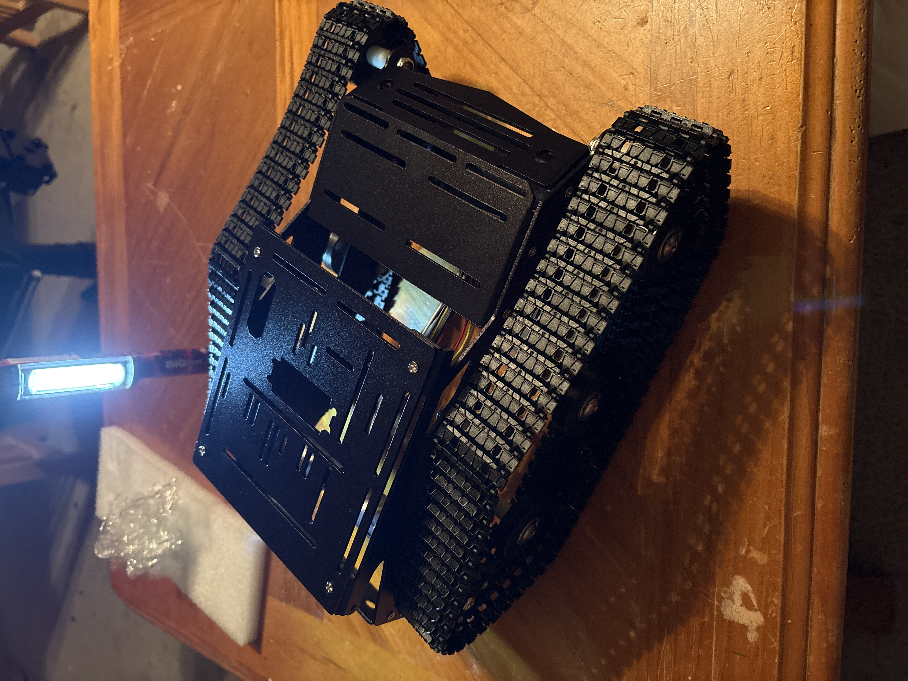
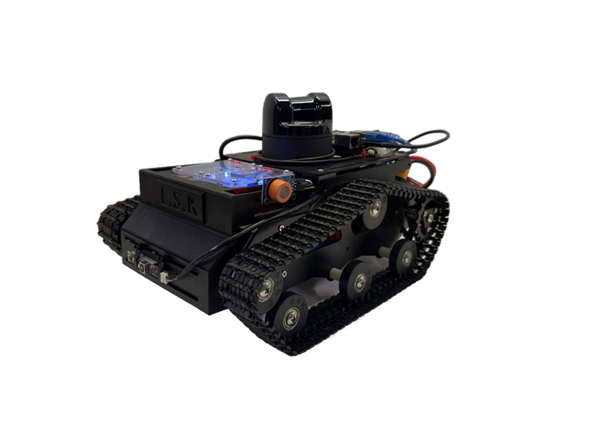
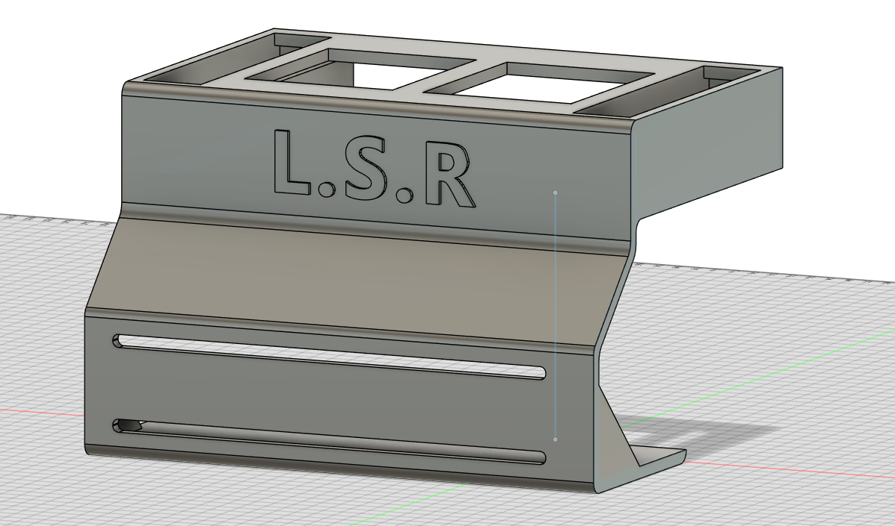
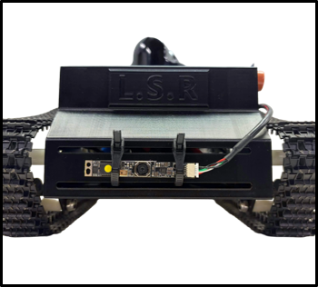
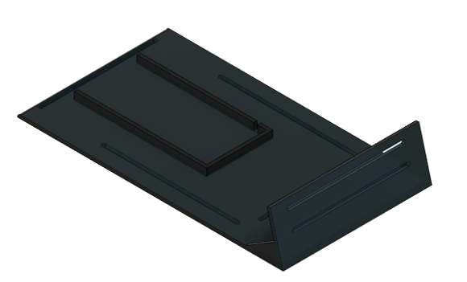
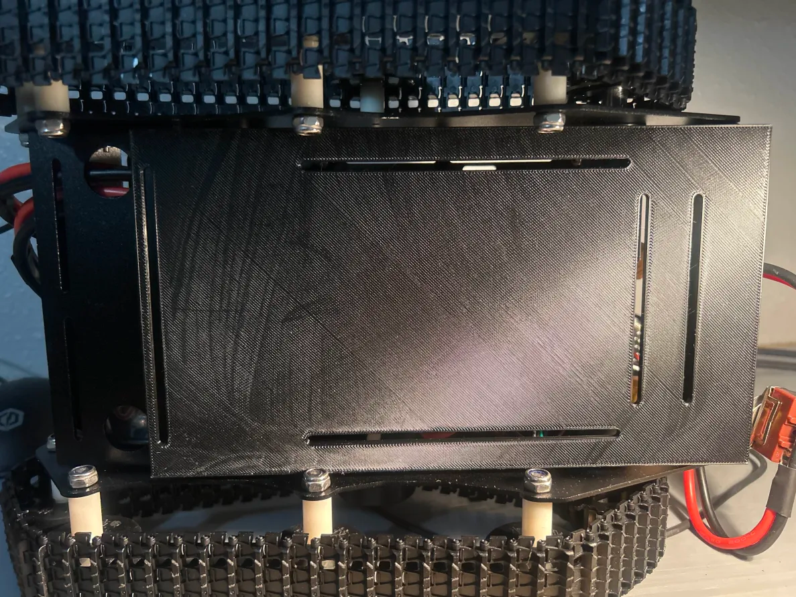

# Lidar-Scout-Rover

## Introduction
The LiDAR Scout Rover is an autonomous mobile robotics platform designed to map and navigate diverse environments using real-time sensing. Developed as a senior project at the University of Houston-Clear Lake, the rover integrates advanced hardware and software to bridge the gap between theoretical autonomous concepts and practical implementation.

## Abstract 
The LiDAR-based Scout Rover project was developed to map spaces, navigate obstacle awareness, monitor gas readings, and display live sensor feedback within a ROS 2 Jazzy system. The final platform used a distributed architecture in which an Arduino Mega handled low-level motor and gas-sensor functions, a Raspberry Pi 5 published LiDAR, camera, and bridge topics, and a workstation ran Point-LIO, Nav2, RViz2, and the main visualization tools. During testing, the rover was able to generate LiDAR maps, publish gas data, stream camera output, and execute navigation experiments with both a frontfocused obstacle pipeline, 360-degree costmap pipeline, and our final pipeline used Point_LIO and Map Corrected pipeline. The results show that a relatively compact multi-computer rover can support practical sensing and semiautonomous navigation, while also highlighting future work in TF stability, software tuning, and demonstration reliability.

## Mechanical  
The mechanical design of the LiDAR Scout Rover focused on creating a compact tracked platform that could support the rover's sensors, electronics, power system, and future autonomous navigation features. The tracked chassis was selected to provide better traction and stability than a standard wheeled platform, especially when testing on uneven indoor surfaces or small obstacles.

During the first semester, the rover was assembled around the base tank chassis. The main mechanical work included mounting the frame, positioning the electronics, routing wiring cleanly through the platform, and making sure the rover had enough open space for future LiDAR, camera, and sensor integration. This early version helped verify the overall layout and showed where additional support plates and mounting points were needed.

During the second semester, custom mechanical parts were designed in Fusion 360 and 3D printed to improve the rover's structure and component placement. These parts included a front mounting plate and skid plate used to protect the lower front area of the chassis. The skid plate also helped the rover slide over small obstacles more smoothly and reduced the chance of the front edge catching during movement.

Key mechanical features include:
- Tracked rover chassis for improved traction and stability
- Custom 3D-printed front plate and skid plate
- Organized mounting layout for LiDAR, camera, electronics, and wiring
- Modular structure that allows components to be adjusted or replaced
- Improved protection for the lower front section of the rover

### Mechanical Images
| Chassis Assembly | Finished Rover |
|---|---|
|  |  |

| Fusion 360 Front Plate | Installed Front Plate |
|---|---|
|  |  |

| Fusion 360 Skid Plate | Installed Skid Plate |
|---|---|
|  |  |
## Electrical 
The electrical system of the LiDAR Scout Rover was designed to connect the rover's power, motor control, sensors, and onboard processing hardware into one organized platform. The main goal was to create a reliable system that could power the rover, collect sensor data, and support communication between the low-level hardware and the ROS 2 software stack.

The rover uses a 6S LiPo battery as the main power source. Since different components require different voltages, buck converters are used to step the battery voltage down to the required levels for the onboard electronics. This allows the rover to power higher-demand components while also providing regulated voltage for devices such as the Raspberry Pi, Arduino, sensors, and motor control hardware.

Insert electrical power distribution diagram here -->

The Arduino Mega is used for low-level control and sensor input. It interfaces with the motor shield to control the rover's DC motors and also reads analog data from the gas sensors. The MQ-2 sensor is used for detecting smoke, LPG, and combustible gases, while the MQ-3 sensor is used for alcohol vapor detection. These sensors provide environmental awareness that can be used alongside the rover's mapping and navigation features.

Insert Arduino, motor shield, and gas sensor wiring diagram here -->

The Raspberry Pi 5 is used as the onboard computing device for connecting higher-level sensors and bridging data into the ROS 2 system. It handles communication with the LiDAR and camera while sending sensor data to the external workstation for mapping, visualization, and navigation. This separation allows the Arduino to focus on low-level hardware control while the Raspberry Pi and workstation handle more demanding processing tasks.

The rover's electrical layout was organized to keep wiring accessible and reduce clutter inside the chassis. Power lines, signal wires, and sensor connections were routed to make debugging and maintenance easier. This was important because the rover required multiple devices to operate together, including the battery system, buck converters, Arduino Mega, Raspberry Pi 5, motor shield, gas sensors, LiDAR, and camera.

Insert full electrical system block diagram here -->

Key electrical features include:
- 6S LiPo battery used as the main power source
- Buck converters used to provide regulated voltage levels
- Arduino Mega for motor control and gas sensor readings
- Motor shield for controlling the tracked rover motors
- Raspberry Pi 5 for sensor communication and ROS 2 data bridging
- MQ-2 and MQ-3 gas sensors for environmental monitoring
- Organized wiring layout for easier testing, maintenance, and troubleshooting

### Electrical Images

Insert battery and power distribution image here -->

Insert Arduino Mega and motor shield image here -->

Insert gas sensor wiring image here -->

Insert Raspberry Pi / onboard electronics image here -->
## Software
